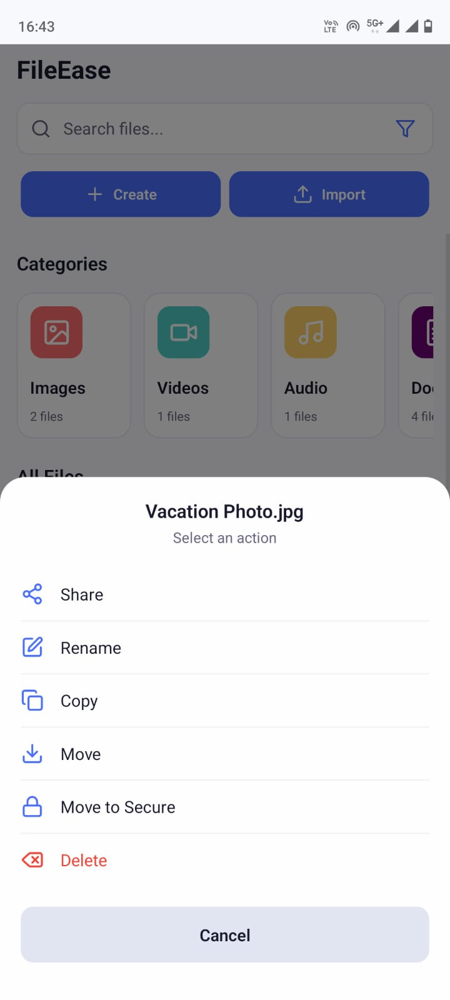

# 📁 FileEase – Android File Management App

**FileEase** is a smart, secure, and modern file manager built for Android using React Native. It offers a seamless experience for managing both local and cloud files with features like intelligent search, secure sharing, and offline access.

---

## 🚀 Features

- 📂 Organize files with create, rename, delete, move, and copy options
- 🔍 Smart search and filter based on type, name, or date
- ☁️ Access and sync Google Drive and Dropbox files
- 🔐 Share files securely with encryption and PIN/biometric lock
- 🌙 Dark and light theme support
- 📡 Offline support for selected cloud files

---

## 🛠️ Technologies Used

- **Framework**: React Native (Expo)
- **Cloud Plateforms Used**: Google Drive, Dropbox, One Drive
- **Security**: Expo SecureStore, LocalAuthentication
- **IDE**: Visual Studio Code

---

## ⚙️ Quick Setup (All Steps)

Follow these steps to get FileEase running on your local development environment:

```bash
# 1. Clone the repository
git clone https://github.com/PriyanshSingh708/FileEase-AndroidApp.git
cd FileEase-AndroidApp

# 2. Install dependencies
npm install

# 3. Install Expo CLI globally if not already installed
npm install -g expo-cli

# 4. Start the development server
npx expo start

```
## 📷 Snapshots


